# Brand Book — تطبيق الأشبال

**الإصدار:** v0.1  
**الحالة:** مسودة تفصيلية قابلة للتطوير  
**اسم المنتج:** الأشبال  
**الغرض:** تطبيق عائلي/تعليمي يساعد على تنظيم دروس القرآن والتجويد والسلوك، وتحفيز الأطفال بطريقة آمنة، دافئة، ومحترمة.

---

## 01. ملخص الهوية

**الأشبال** ليس تطبيق ألعاب، وليس منصة تعليم رسمية جامدة. هو مساحة تربوية حديثة تجمع بين:

- القرآن والتجويد.
- السلوك والقيم.
- المتابعة الأسرية.
- التحفيز الهادئ.
- الخصوصية، خصوصًا في فيديوهات الأطفال.

الهوية يجب أن تشعر الطفل أنه داخل رحلة جميلة، وتشعر ولي الأمر بالطمأنينة، وتشعر المعلم أن لديه أداة منظمة وسريعة.

### الوعد الأساسي

> نساعد الطفل أن يرى تقدمه في القرآن والسلوك بطريقة واضحة، جميلة، ومحفزة، بدون مقارنة جارحة وبدون تحويل التعلم إلى صفقة مادية.

### شخصية البراند

| المحور | الوصف |
|---|---|
| الشعور | دافئ، آمن، راقٍ، مشجع |
| الأسلوب | حديث، بنفسجي، ناعم، منظم |
| الطفل | يشعر بالإنجاز والانتماء |
| ولي الأمر | يشعر بالاطمئنان والمتابعة السهلة |
| المعلم | يشعر أن التطبيق يوفر الوقت ولا يزيد العبء |
| الخطورة التي نتجنبها | لعبة بزيادة، تطبيق رسمي ميت، رشوة مادية، زخرفة دينية ثقيلة |

---

## 02. المبادئ التصميمية

### 1. بنفسجي هو الأساس

التطبيق يجب أن يكون **غالبًا بنفسجيًا** وليس أبيض بالكامل ولا دارك مود خانق. الأبيض يستخدم فقط لكروت محددة أو حالات تحتاج وضوح عالي.

### 2. دوائر، حلقات، وشارات

العنصر التصميمي الأساسي هو **الدائرة**:

- دوائر تقدم.
- دوائر أيقونات.
- حلقات ناعمة في الخلفية.
- شارات دائرية أو شبه دائرية.
- صور شخصية دائرية.

الدائرة هنا ترمز للحلقة، الرحلة، الاستمرارية، والحماية.

### 3. روح إسلامية بدون مبالغة

مسموح استخدام لمسات خفيفة:

- هلال/نجوم بسيطة.
- ظلال معمارية خافتة.
- نور خفيف.
- زخارف شبه غير مرئية.

ممنوع:

- زخارف كثيرة.
- أخضر إسلامي صارخ.
- مصحف ضخم في كل شاشة.
- شكل تطبيق جمعية قديم.

### 4. الطفل ليس “لاعبًا” فقط

نستخدم التحفيز، الأوسمة، والإنجازات، لكن بدون تحويل التطبيق إلى لعبة كاملة. الفايب المطلوب: **تطبيق حائز على جوائز للأطفال والعائلة**، مو لعبة كرتونية.

---

## 03. الاسم والاستخدام اللفظي

### الاسم الرسمي

**الأشبال**

### كتابته

- صحيح: `الأشبال`
- خطأ: `نادي الأشبال` كاسم المنتج الرسمي
- خطأ: `أشبال القرآن` كاسم المنتج الرسمي

يمكن استخدام عبارات داخلية مثل:

- رحلة الشبل
- مهمة اليوم
- أوسمة الأشبال
- أمنياتي
- تقدّم الشبل
- لوحة المعلم

### وصف مختصر

> تطبيق يساعد الأطفال على التقدم في القرآن والتجويد والسلوك، ويمنح الأهل والمعلمين متابعة سهلة وآمنة.

### وصف عرض تقديمي

> الأشبال هو تطبيق عائلي تعليمي يحول دروس القرآن والتجويد والسلوك إلى رحلة متابعة وتحفيز، حيث يرى الطفل تقدمه، يراجع ولي الأمر إنجازاته، ويدير المعلم الحلقة بسهولة، مع مراعاة الخصوصية الكاملة للأطفال.

---

## 04. الشعار والرمز

> ملاحظة: هذا البراند بوك يحدد قواعد الشعار. النسخة النهائية من الشعار تحتاج تنفيذ SVG/Vector لاحقًا.

### الفكرة الأساسية للشعار

رمز عربي مبني على حرف **ش** من كلمة الأشبال، داخل دائرة أو شارة ناعمة.

### عناصر الشعار

- حرف **ش** كرمز رئيسي.
- ثلاث نقاط يمكن تحويلها إلى نجوم/نقاط نور.
- دائرة أو شارة تمثل الحلقة والحماية.
- لمسة شبل خفيفة جدًا، بدون وجه كرتوني صريح إذا كان الاتجاه راقي.

### نسخ الشعار

1. **الشعار الكامل**  
   الرمز + كلمة الأشبال.

2. **الرمز فقط**  
   يستخدم لأيقونة التطبيق، الفافيكون، البوتون، البادجات.

3. **نسخة أحادية**  
   أبيض على خلفية بنفسجية، أو بنفسجي غامق على خلفية فاتحة.

4. **نسخة صغيرة**  
   الرمز فقط بدون تفاصيل دقيقة.

### مساحة الأمان

اترك حول الشعار مساحة لا تقل عن عرض نقطة من نقاط حرف **ش** من كل جانب.

### الحد الأدنى للحجم

| الاستخدام | الحد الأدنى |
|---|---:|
| أيقونة تطبيق | 512×512 px |
| شعار في الهيدر | 32 px ارتفاع |
| شعار في عرض تقديمي | 80 px ارتفاع |
| فافيكون | رمز مبسط جدًا فقط |

### ممنوعات الشعار

- لا تمد الشعار أفقيًا أو رأسيًا.
- لا تستخدم Gradient صاخب على الكلمة.
- لا تضيف ظل ثقيل.
- لا تضع الشعار فوق خلفية مزدحمة بدون طبقة فصل.
- لا تضيف وجه أسد كرتوني كامل داخل الشعار الأساسي.
- لا تستخدم أخضر/ذهبي كلاسيكي كهوية رئيسية.

---

## 05. لوحة الألوان

### الألوان الأساسية

| الاسم | Hex | الاستخدام |
|---|---|---|
| Night Purple | `#0D0820` | أغمق خلفية، حالات عمق |
| Deep Purple | `#1A1038` | خلفيات رئيسية |
| Royal Purple | `#2B1763` | كروت داكنة، مناطق رئيسية |
| Main Purple | `#6D4CFF` | أزرار، حالات نشطة، عناصر تفاعل |
| Soft Purple | `#9F84FF` | تدرجات، حلقات، secondary actions |
| Lavender Mist | `#D8CCFF` | نصوص مساعدة، خلفيات ناعمة |
| Warm White | `#FFF8EA` | كروت مختارة، نصوص مضيئة |
| Badge Gold | `#F6C65B` | أوسمة وإنجازات |
| Success Mint | `#63D9A0` | نجاح، اعتماد، حضور |
| Alert Coral | `#F97373` | تنبيه، رفض، خطأ لطيف |

### نسب الاستخدام

| اللون | النسبة المقترحة |
|---|---:|
| بنفسجي غامق ومتوسط | 65–75% |
| بنفسجي فاتح ولافندر | 10–15% |
| أبيض/كريمي | 8–12% |
| ذهبي | 3–5% |
| أخضر/كورال للحالات فقط | 2–4% |

### قاعدة الأبيض

الأبيض ليس خلفية عامة للتطبيق. يستخدم فقط في:

- كرت مهم يحتاج قراءة واضحة.
- زر إجراء ثانوي.
- بطاقة خصوصية/تنبيه.
- مساحة Dashboard داخلية محدودة.

### أمثلة التدرجات

```css
--gradient-hero: radial-gradient(circle at 50% 20%, #6D4CFF 0%, #2B1763 42%, #0D0820 100%);
--gradient-card: linear-gradient(145deg, #3A207C 0%, #1A1038 100%);
--gradient-button: linear-gradient(135deg, #8B6CFF 0%, #6D4CFF 55%, #4B2BC7 100%);
--gradient-badge: linear-gradient(135deg, #F8D77A 0%, #F6C65B 45%, #B98221 100%);
```

---

## 06. الخطوط والطباعة

### الخط الأساسي

**Baloo Bhaijaan 2**  
يستخدم للواجهة العربية لأنه من عائلة Baloo ويدعم العربية.

### بدائل fallback

```css
font-family: 'Baloo Bhaijaan 2', 'Cairo', 'Tajawal', system-ui, sans-serif;
```

### مستويات النص

| المستوى | الحجم المقترح | الوزن | الاستخدام |
|---|---:|---:|---|
| Display | 42–56 px | 800 | عناوين العروض والـ Hero |
| H1 | 28–34 px | 800 | عناوين الشاشات |
| H2 | 22–26 px | 700 | عناوين الأقسام |
| Card Title | 17–20 px | 700 | عناوين الكروت |
| Body | 14–16 px | 500 | النصوص العادية |
| Caption | 11–13 px | 400–500 | ملاحظات وحالات |
| Button | 15–17 px | 700 | الأزرار |

### قواعد النص

- النصوص قصيرة ومباشرة.
- لا نكثر علامات التعجب.
- لا نستخدم كلمات تخويف مع الطفل مثل “فشل” أو “مرفوض”.
- للطفل نقول: “خلّينا نعيدها بشكل أوضح”.
- لولي الأمر نقول: “يرجى مراجعة الفيديو قبل الإرسال”.
- للمعلم نقول: “بانتظار التقييم”.

---

## 07. أسلوب الواجهة UI System

### الزوايا

| العنصر | Radius |
|---|---:|
| كروت كبيرة | 28–32 px |
| كروت صغيرة | 20–24 px |
| أزرار | 18–22 px |
| شرائح/Chips | 999 px |
| صور شخصية | 50% |

### الظلال

الظلال يجب أن تكون ناعمة جدًا.

```css
--shadow-soft: 0 18px 45px rgba(9, 3, 30, 0.28);
--shadow-card: 0 12px 30px rgba(13, 8, 32, 0.22);
--shadow-glow: 0 0 32px rgba(109, 76, 255, 0.35);
```

### الخلفيات

- خلفية الطفل: بنفسجية حالمة، نجوم خفيفة.
- خلفية ولي الأمر: بنفسجية هادئة، أقل زخرفة.
- خلفية المعلم: بنفسجي عميق + مساحة Dashboard أوضح.
- خلفية العروض: Gradient بنفسجي مع دوائر ضوئية.

### الكروت

أنواع الكروت:

1. **Primary Purple Card**  
   يستخدم للمهمة الرئيسية والتقدم.

2. **Light Contrast Card**  
   أبيض/كريمي محدود للخصوصية أو ملخصات.

3. **Status Card**  
   حالات مثل حاضر، متأخر، بانتظار موافقة.

4. **Badge Card**  
   لوسام اليوم والإنجازات.

5. **Review Card**  
   للفيديوهات وموافقة ولي الأمر.

---

## 08. الأيقونات

### الأسلوب

- Rounded line icons.
- سماكة متوسطة.
- داخل دوائر أو مربعات مستديرة.
- لا تستخدم أيقونات حادة أو تقنية جدًا.

### مكتبة مقترحة

- Lucide Icons كقاعدة.
- أيقونات مخصصة للشارات لاحقًا.

### ألوان الأيقونات

| الحالة | اللون |
|---|---|
| عادي | Lavender Mist |
| نشط | Main Purple / Warm White |
| نجاح | Success Mint |
| إنجاز | Badge Gold |
| تنبيه | Alert Coral |

### أيقونات أساسية مطلوبة

- القرآن / كتاب.
- التجويد / موجة صوت.
- السلوك / قلب.
- الحضور / أشخاص.
- التسميع / كاميرا أو ميكروفون.
- موافقة ولي الأمر / درع.
- الأمنيات / نجمة أو مصباح.
- الأوسمة / شارة.
- التنبيهات / جرس.
- المعلم / لوحة أو قائمة.

---

## 09. الصور والرسوم

### الاتجاه البصري

الصور المرجعية الحالية تستخدم:

- جو بنفسجي ليلي.
- دوائر وحلقات ضوئية.
- ظلال معمارية إسلامية خفيفة.
- واجهات App Mockups.
- شاشات موبايل وديسكتوب.

### الصور المرجعية داخل الحزمة

| الصورة | الاستخدام |
|---|---|
| `images/hero.jpg` | العرض العام للتطبيق |
| `images/child.jpg` | تجربة الطفل |
| `images/video.jpg` | مهمة التسميع بالفيديو |
| `images/progress_badges.jpg` | التقدم والأوسمة |
| `images/parent.jpg` | تجربة ولي الأمر |
| `images/approval.jpg` | موافقة ولي الأمر |
| `images/teacher.jpg` | لوحة المعلم |
| `images/attendance.jpg` | إدارة الحلقة والحضور |
| `images/notifications.jpg` | التنبيهات والملخصات |
| `images/progress_bar.jpg` | بار التقدم |
| `images/wishes_child.jpg` | الأمنيات عند الطفل |
| `images/wishes_parent.jpg` | الأمنيات عند ولي الأمر |

### قواعد الصور

- لا نجعل الطفل كرتونيًا جدًا.
- لا نستخدم mascot ضخم.
- لا نعرض فيديوهات أطفال حقيقية في المواد العامة.
- لا نستخدم وجوه حقيقية بدون موافقة.
- لا نعرض أسماء أطفال حقيقية في العروض العامة.
- نستخدم أسماء وهمية في التصاميم: عبدالله، طلال، محمد، سلمان.

---

## 10. نظام الأوسمة والشارات

### فلسفة الأوسمة

الأوسمة ليست رشوة. هي اعتراف بالتقدم.

### أنواع الأوسمة

#### القرآن

- وسام المثابر.
- وسام التلاوة الواضحة.
- وسام المراجعة.
- وسام الثبات.

#### التجويد

- صديق المدود.
- فارس الغنة.
- حارس المخارج.
- متقن الوقف.

#### السلوك

- شبل الصدق.
- شبل الاحترام.
- شبل التعاون.
- شبل الحلم.
- شبل العزة.

### شكل الشارة

- دائرة أو درع ناعم.
- ذهب محدود.
- خلفية بنفسجية.
- نجمة أو رمز بسيط.
- بدون تفاصيل كثيرة.

### استخدام الشارات

- داخل صفحة الطفل.
- تقارير ولي الأمر.
- ملخص المعلم.
- شهادات مطبوعة لاحقًا.
- احتفالات نهاية المرحلة.

---

## 11. تجربة الطفل

### الهدف

يشعر الطفل أنه في رحلة إنجاز، لا في اختبار دائم.

### الصفحة الرئيسية

تحتوي على:

- ترحيب: “مرحباً طلال”.
- مهمة اليوم.
- دخول الدرس.
- مهمة التسميع.
- بار التقدم.
- القرآن / التجويد / السلوك.
- وسام اليوم.
- الأمنيات.

### أسلوب النص للطفل

| الحالة | النص المقترح |
|---|---|
| بدء مهمة | “جاهز لمهمة اليوم؟” |
| نجاح | “أحسنت، خطوة جميلة!” |
| إعادة تسجيل | “خلّينا نعيدها بشكل أوضح” |
| انتظار موافقة | “بانتظار مراجعة ولي الأمر” |
| اكتمال تقدم | “أنجزت مرحلة جديدة!” |

### ممنوعات تجربة الطفل

- “فشلت”.
- “تم رفضك”.
- “أنت آخر واحد”.
- Leaderboard مباشر بين الأطفال.
- ضغط مادي: “اجمع نقاط عشان هدية”.

---

## 12. تجربة ولي الأمر

### الهدف

متابعة سهلة، اطمئنان، وقرار واضح.

### الصفحة الرئيسية

تحتوي على:

- بطاقة الطفل.
- ملخص اليوم.
- فيديو بانتظار الموافقة.
- تقدم القرآن والتجويد والسلوك.
- ملاحظات المعلم.
- الأمنيات.
- التنبيهات.

### موافقة الفيديو

التدفق:

1. الطفل يسجل الفيديو.
2. التطبيق يفحص الشروط الأساسية.
3. يصل الفيديو لولي الأمر.
4. ولي الأمر يوافق أو يطلب إعادة.
5. فقط بعد الموافقة يصل للمعلم.

### نصوص الخصوصية

- “راجع الفيديو قبل إرساله للمعلم.”
- “تأكد أن الخلفية مناسبة.”
- “لن يصل الفيديو للمعلم إلا بعد موافقتك.”

---

## 13. تجربة المعلم

### الهدف

إدارة الدرس بسرعة ووضوح.

### لوحة المعلم

تكون Desktop-first وتحتوي على:

- حلقة اليوم.
- رابط Google Meet.
- الحضور.
- فيديوهات تنتظر المراجعة.
- قائمة الأطفال.
- تقييم سريع.
- إرسال ملخص للأهل.

### أسلوب UI للمعلم

- أقل زخرفة من الطفل.
- جداول واضحة.
- أزرار عملية.
- حالات ملونة.
- مساحة قراءة جيدة.

### لا تظهر للمعلم

- أمنيات الطفل الخاصة.
- أي فيديو قبل موافقة ولي الأمر.
- معلومات عائلية غير ضرورية.

---

## 14. ضيف الشرف

### الهدف

عرض الإنجاز بدون كشف بيانات حساسة.

### ما يراه

- عدد الأطفال العام.
- عدد الحضور العام.
- عدد الأوسمة المكتسبة.
- إنجازات جماعية.
- شاشة Presentation عامة.

### ما لا يراه

- أسماء كاملة للأطفال.
- فيديوهات.
- أمنيات.
- ملاحظات خاصة.
- تقييمات فردية حساسة.

---

## 15. نظام الفيديو والخصوصية

### المبادئ

- الفيديو حساس لأنه لطفل وداخل البيت.
- ولي الأمر هو بوابة الموافقة.
- المعلم لا يرى الفيديو إلا بعد موافقة ولي الأمر.
- الفيديو لا يخزن للأبد.

### حالات الفيديو

1. تسجيل جديد.
2. بانتظار مراجعة ولي الأمر.
3. إعادة تسجيل مطلوبة.
4. موافق عليه من ولي الأمر.
5. بانتظار تقييم المعلم.
6. تم التقييم.
7. محذوف بعد مدة.

### إرشادات التسجيل

- اجلس في مكان واضح.
- اجعل وجهك وصوتك واضحين.
- ضع الجهاز أمامك.
- ابدأ عندما تكون جاهزًا.

### لا نستخدم لغة اتهامية

بدل “لا تغش”، نقول:

> خلّينا نشوفك وأنت تسمّع بثقة.

---

## 16. الأمنيات وبار التقدم

### التعديل التربوي المعتمد

الأمنيات ليست وعدًا ماديًا ولا عقد جائزة.

### أمنياتي

الطفل يكتب ما يتمناه:

- كوينز حي الأشبال.
- طلعة مع بابا.
- كتاب جديد.
- هدية بسيطة.
- تجربة عائلية.

تظهر فقط لولي الأمر.

### بار التقدم

بار عام يمتلئ من:

- التسميع.
- الحضور.
- السلوك.
- المراجعة.
- المشاركة.

عند اكتماله يحصل الطفل أساسًا على:

- شارة.
- إنجاز.
- لقب.
- احتفال داخل التطبيق.

ولي الأمر يمكنه اختياريًا:

- الاحتفاظ بالأمنية.
- تحويلها لهدف مستقبلي.
- مكافأة الطفل بشارة.
- مكافأة داخلية.
- مكافأة عائلية إن رغب.

### نصوص مقترحة

- “اكتب أمنيتك، ولي أمرك يشوفها.”
- “الأمنيات للتعبير، وليست وعدًا مباشرًا.”
- “عند اكتمال تقدمك تحصل على إنجاز جديد.”
- “يمكن لولي الأمر اختيار مكافأة مناسبة.”

---

## 17. الإشعارات

### للطفل

- “مهمة اليوم جاهزة.”
- “بانتظار موافقة ولي الأمر.”
- “حصلت على وسام جديد.”
- “اقتربت من إكمال تقدمك.”

### لولي الأمر

- “فيديو جديد بانتظار موافقتك.”
- “تم تقييم تسميع طفلك.”
- “طفلك أضاف أمنية جديدة.”
- “طفلك أكمل مرحلة تقدم جديدة.”

### للمعلم

- “فيديو جديد بانتظار المراجعة.”
- “حان وقت الحلقة.”
- “لم يتم إرسال ملخص الدرس.”

### قاعدة النص

الإشعار قصير، واضح، بدون ضغط زائد.

---

## 18. الاستخدامات خارج التطبيق

### العروض التقديمية

- خلفية بنفسجية غامقة.
- عنوان كبير Baloo.
- صورة واجهة واحدة في كل شريحة.
- لا تضع 6 شاشات في شريحة واحدة إلا في Overview.
- استخدم دوائر كفواصل ومؤشرات.

### السوشال ميديا

مقاسات:

- Instagram Post: 1080×1350.
- Story: 1080×1920.
- X/LinkedIn: 1600×900.

أسلوب المحتوى:

- Feature spotlight.
- Before/After.
- Parent reassurance.
- Teacher workflow.
- Child progress.

### الشهادات

- بنفسجي غامق أو كريمي.
- شعار الأشبال في الأعلى.
- شارة كبيرة في الوسط.
- اسم الطفل واضح.
- سبب الشهادة.
- توقيع المعلم.

### بطاقات الدعوة

- بسيطة.
- شعار + عنوان.
- موعد الحلقة.
- رابط Meet أو QR.
- لون بنفسجي رئيسي.

### التقارير

- للوالد: مختصر وواضح.
- للمعلم: مفصل وقابل للفلترة.
- للعرض: بدون بيانات حساسة.

---

## 19. القواعد اللغوية Tone of Voice

### مع الطفل

نبرة:

- مشجعة.
- بسيطة.
- دافئة.
- بدون تهديد.

أمثلة:

- “أحسنت يا شبل!”
- “خطوة جميلة اليوم.”
- “باقي القليل على الوسام.”
- “خلّينا نعيد التسجيل بشكل أوضح.”

### مع ولي الأمر

نبرة:

- مطمئنة.
- واضحة.
- تحترم قراره.

أمثلة:

- “فيديو جديد بانتظار مراجعتك.”
- “لن يصل الفيديو للمعلم إلا بعد موافقتك.”
- “طفلك أضاف أمنية جديدة يمكنك الاطلاع عليها.”

### مع المعلم

نبرة:

- عملية.
- مختصرة.
- مباشرة.

أمثلة:

- “5 فيديوهات بانتظار المراجعة.”
- “إرسال ملخص الحلقة للأهل.”
- “تعديل حالة الحضور.”

---

## 20. إمكانية الوصول Accessibility

### التباين

- النص الأبيض على البنفسجي يجب أن يكون عالي التباين.
- لا تستخدم Lavender فاتح كنص صغير على خلفية فاتحة.
- الحالات لا تعتمد على اللون فقط؛ استخدم أيقونة ونص.

### قابلية القراءة

- حجم النص للطفل لا يقل عن 15px.
- الأزرار لا تقل عن 44px ارتفاع.
- المسافات بين الأزرار واضحة.

### RTL

- كل الواجهات عربية RTL.
- الأيقونات الاتجاهية يجب عكسها عند الحاجة.
- الجداول في لوحة المعلم تبدأ من اليمين.

---

## 21. أمثلة الشاشات المرجعية

### Overview

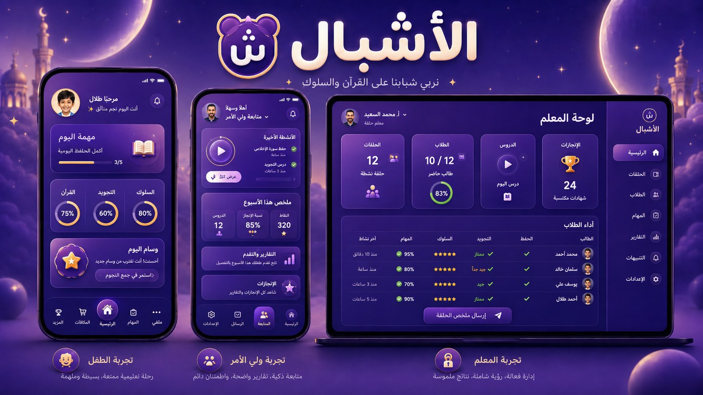

### تجربة الطفل

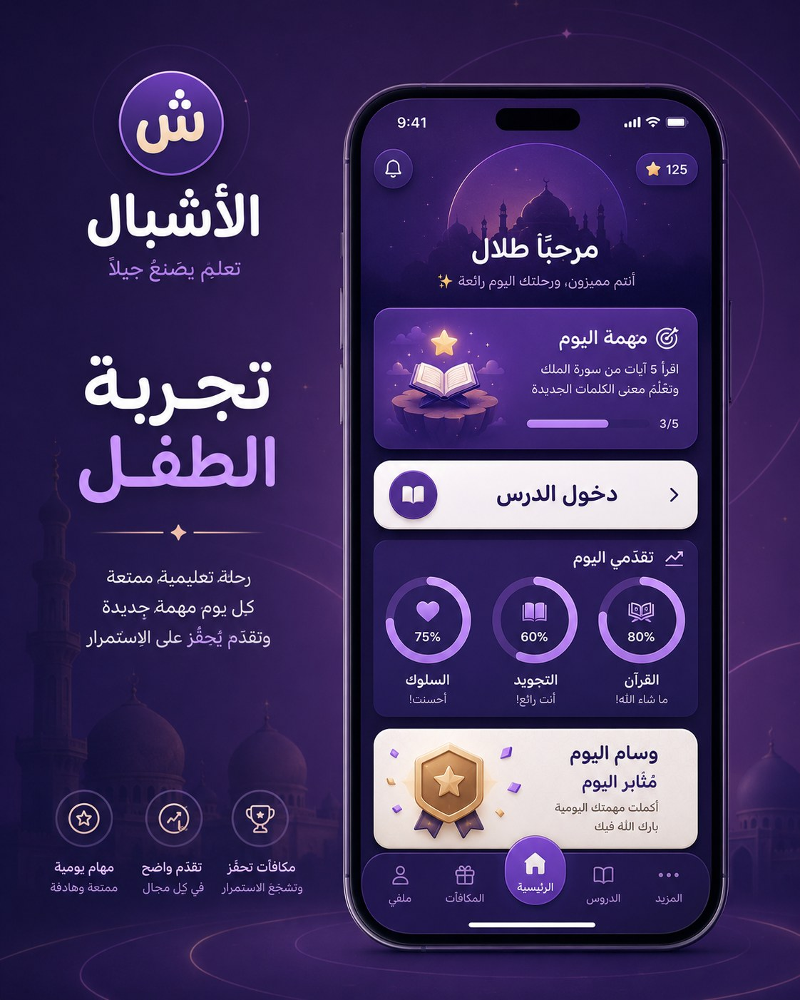

### مهمة التسميع بالفيديو

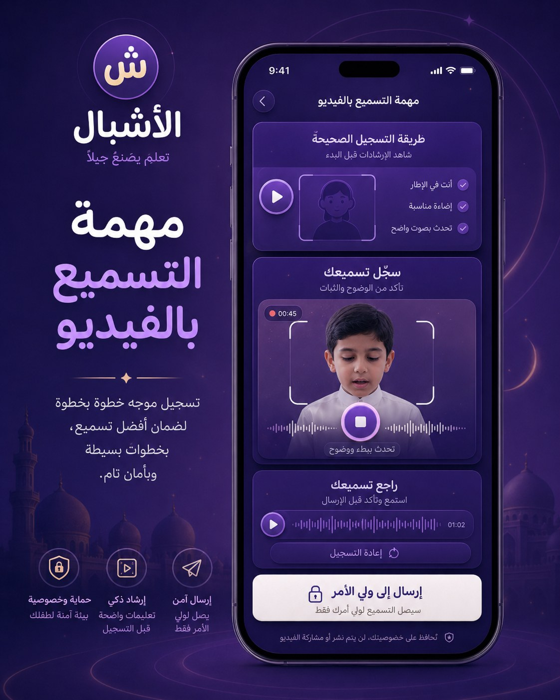

### التقدم والأوسمة

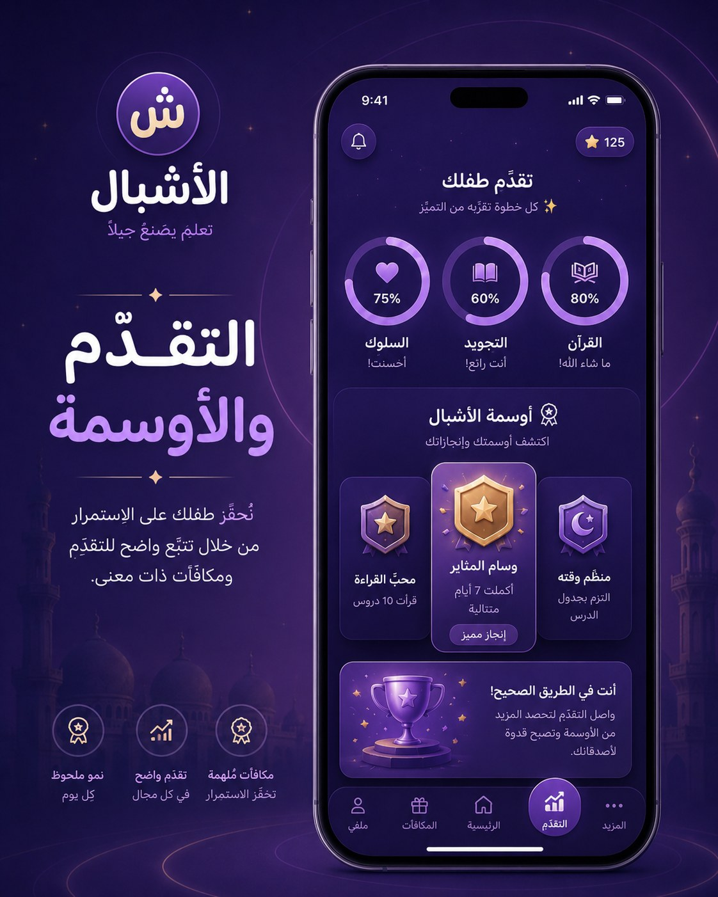

### تجربة ولي الأمر

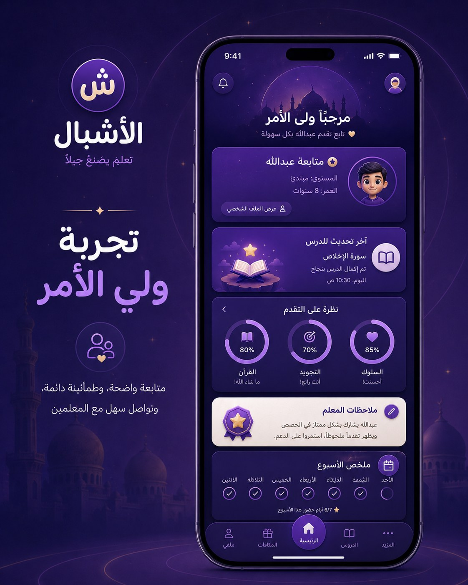

### موافقة ولي الأمر

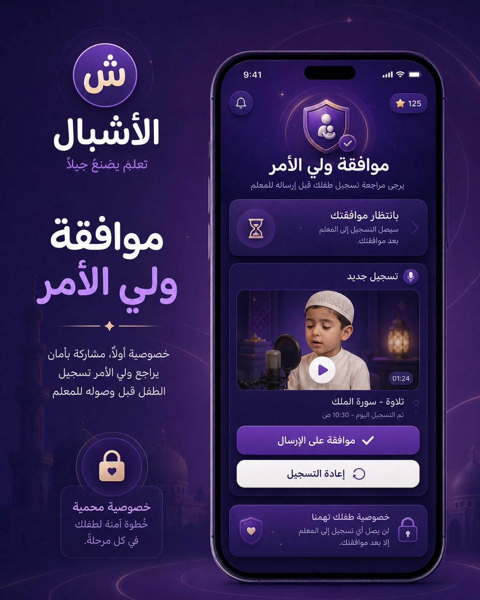

### لوحة المعلم

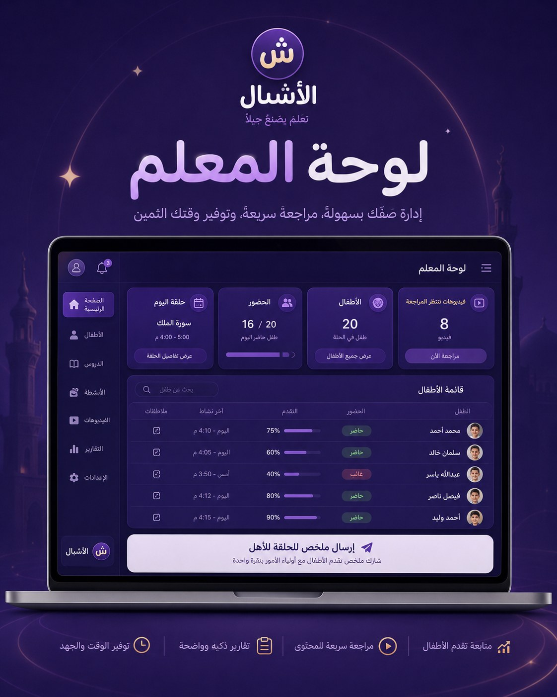

### إدارة الحلقة والحضور

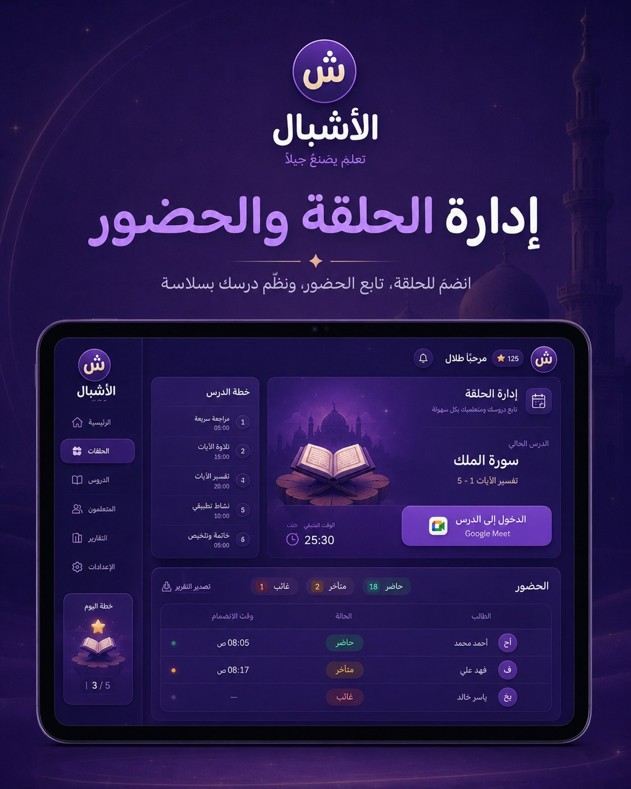

### التنبيهات والملخصات

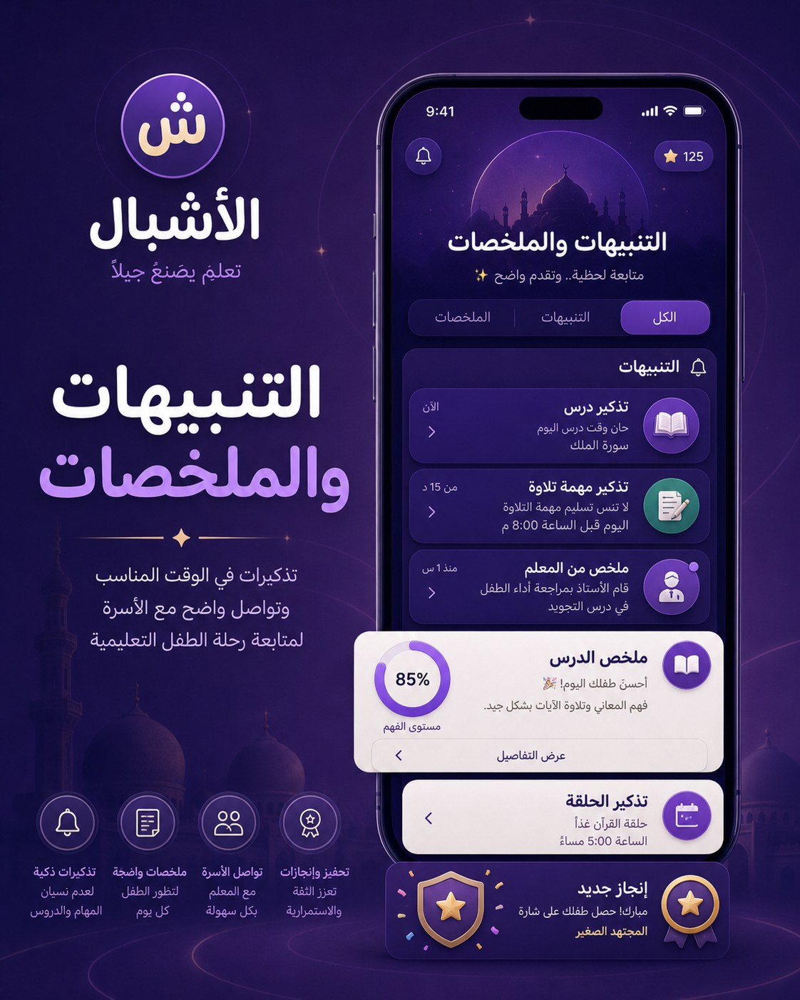

### بار التقدم

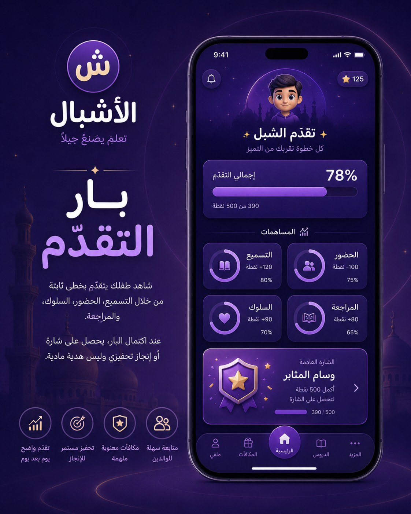

### أمنيات الطفل

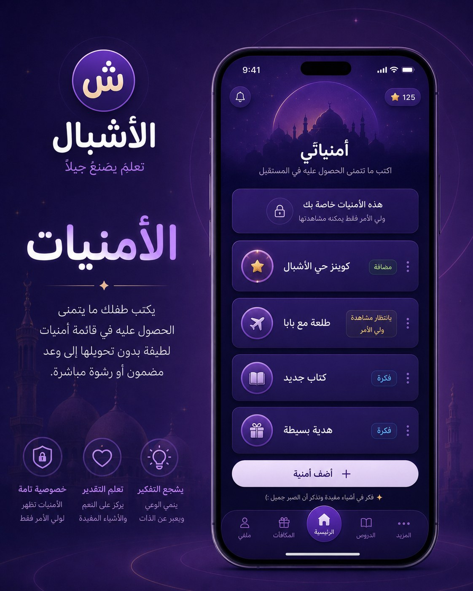

### الأمنيات عند ولي الأمر

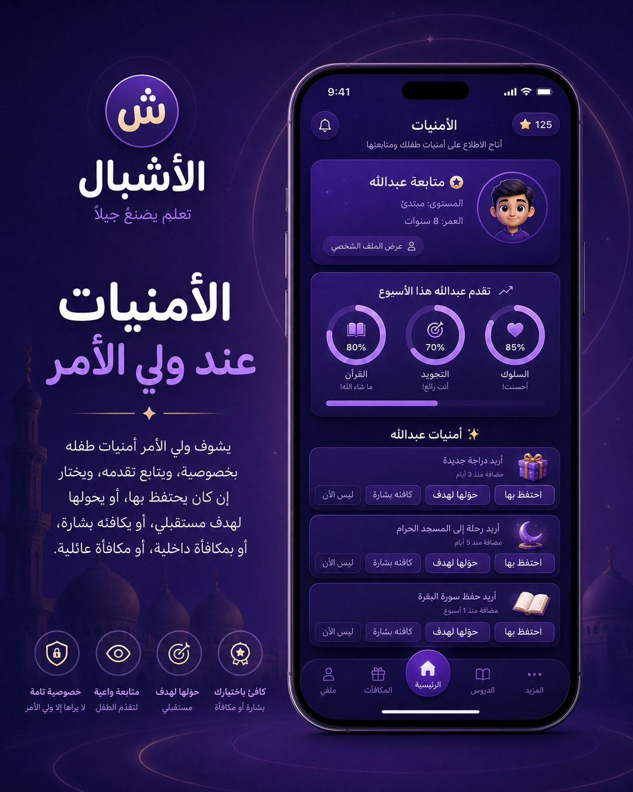

---

## 22. مكونات UI الأساسية

### Buttons

#### Primary Button

- خلفية Main Purple.
- نص أبيض.
- Radius 20px.
- ظل ناعم.

#### Secondary Button

- خلفية Purple Card.
- Border Lavender.
- نص Warm White.

#### Light Button

- خلفية Warm White.
- نص Deep Purple.
- يستخدم قليلًا.

### Cards

#### Mission Card

- Gradient Purple.
- أيقونة دائرية.
- Progress صغير.
- CTA واضح.

#### Approval Card

- Light card محدود.
- زر موافقة واضح.
- زر إعادة تسجيل ثانوي.

#### Teacher Table Card

- Dark panel.
- Rows منفصلة.
- Badges للحالات.

### Progress

- Circular progress للتصنيفات.
- Linear progress للبار العام.
- Gold للإنجاز القادم.

### Badges

- دائرة/درع.
- Gold + Purple.
- اسم قصير.
- وصف بسيط.

---

## 23. تطبيق الهوية في PWA

### App Icon

- رمز “ش” داخل دائرة بنفسجية.
- خلفية Deep Purple.
- نقطة/نجمة ذهبية صغيرة.
- بدون نص طويل.

### Splash Screen

- خلفية Deep Purple.
- شعار في الوسط.
- كلمة الأشبال تحت الرمز.

### Favicon

- الرمز فقط.
- تبسيط النقاط لو الحجم صغير.

### Web Manifest Theme

```json
{
  "theme_color": "#1A1038",
  "background_color": "#0D0820"
}
```

---

## 24. Do / Don't

### Do

- استخدم البنفسجي كهوية أساسية.
- استخدم الدوائر في النظام كله.
- اجعل النصوص قصيرة وواضحة.
- احمِ خصوصية الطفل في كل شاشة.
- اجعل الأبيض محدودًا.
- صمم للطفل وولي الأمر والمعلم بواجهات مختلفة.

### Don't

- لا تجعل التطبيق أبيض بالكامل.
- لا تجعل التطبيق لعبة كرتونية.
- لا تستخدم Leaderboard جارح.
- لا تجعل الأمنيات وعدًا ماديًا.
- لا تعرض فيديو قبل موافقة ولي الأمر.
- لا تخلط صلاحيات الأدوار.
- لا تجعل المعلم مسؤولًا عن هدايا الأطفال.

---

## 25. ملفات التوكنز

تم تجهيز ملفات عملية:

- `tokens/design-tokens.json`
- `tokens/brand-tokens.css`

تستخدم للمطور أو Claude لضبط الألوان، الخطوط، والـ UI system.

---

## 26. Prompt مختصر لتوليد صور بنفس الهوية

استخدم هذا عند توليد صور جديدة:

```txt
Create a premium Arabic app UI feature poster for "الأشبال". Use a mostly purple and dark-purple brand identity, Baloo Bhaijaan-style rounded Arabic typography, subtle white only on selected cards, circular motifs, soft glowing rings, refined Islamic-inspired atmosphere without heavy ornamentation, and an award-winning modern product design feel. Avoid game-like clutter and mascots. Keep the UI RTL, elegant, child-safe, and family-friendly.
```

---

## 27. ملخص قرار الهوية

- الاسم: **الأشبال**.
- اللون: بنفسجي/بنفسجي غامق كأساس.
- الخط: Baloo Bhaijaan 2.
- العنصر التصميمي: الدوائر والحلقات.
- الفايب: تطبيق تربوي حديث، دافئ، آمن، حائز على جوائز.
- لا نريد: لعبة بزيادة، دارك مود كامل، زخرفة دينية ثقيلة، أو نظام جوائز مادية مباشرة.

